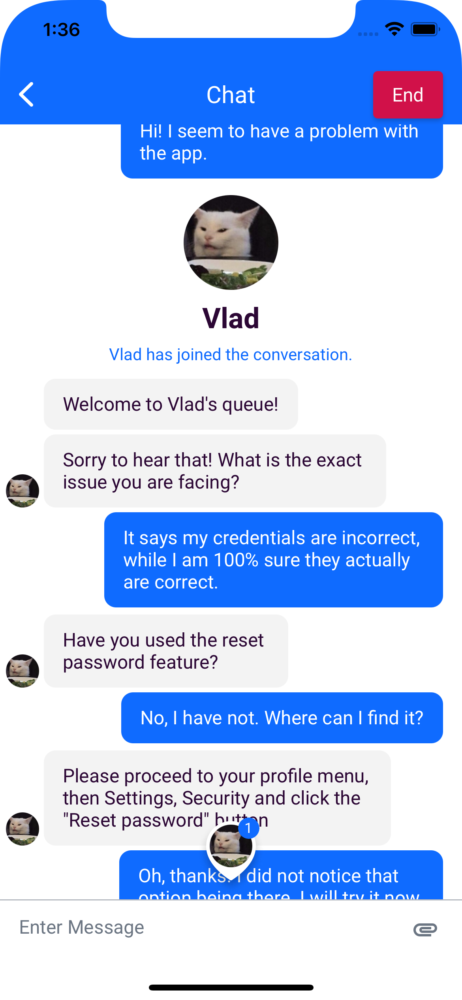

[order]: # (3)
# General Notes

## Convenience
The GliaWidgets iOS SDK provides a convenient entry point to using the core Glia SDK without having to do most of the UI related programming.

## Customization
The GliaWidgets iOS SDK allows customizing its colors, icons and text appearance via a custom Theme.

It is also possible to avoid creating a custom Theme in which case the Widgets will stay in their default appearance.
For example, chat default look:

  

To read more about customization, navigate to the [Creating a Theme](creating-a-theme) page and other pages in the Customization section.

### UIImage
To be able to choose any icon's color, the asset used should be set to "Render as: Template Image". That applies to every image, color of which can be changed.
